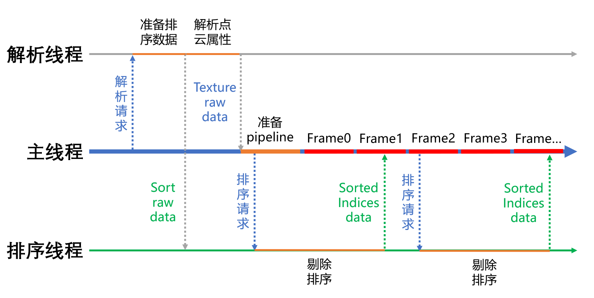
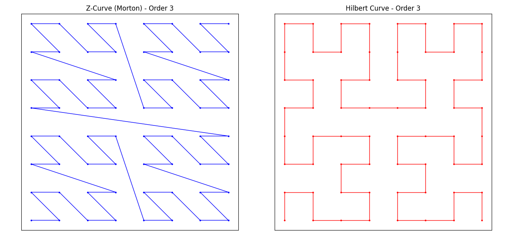

# ImmerScape
## 一、项目背景
随着计算机图形学和视觉技术的不断发展，高斯渲染技术近年来得到了广泛的关注和应用。它能够生成高质量、逼真的图像和视频，为用户带来沉浸式的视觉体验。然而，随着技术的不断更新迭代，当前的高斯渲染技术在实际应用中也面临着一些挑战和问题。

一方面，沉浸式视频和体验的需求日益增长。无论是虚拟现实、增强现实，还是高清影视制作等领域，用户都期望能够获得更加真实、细腻且沉浸式的视觉效果。但是由于其过大的文件体积、复杂的计算过程和对硬件资源的高要求，往往难以在普通设备上实现流畅的沉浸式体验，限制了其在更广泛场景中的应用。

另一方面，越来越多的普通用户希望通过高斯渲染技术来拍摄和记录生活中的美好瞬间或者进行创意内容的创作。然而，高斯的训练对于普通用户来说难以企及，同时移动端交互受限，缺少面向普通用户和移动端的高斯查看器。

综上所述，为了推动高斯渲染技术的进一步发展和普及，满足日益增长的沉浸式体验需求，降低普通用户的使用门槛，以及优化文件存储和渲染效率，我们启动了本项目。本项目旨在通过技术创新和优化，解决当前高斯渲染技术面临的这些问题，使其能够依托于浏览器更加高效、便捷地应用于各种设备和场景，为用户提供更加优质的沉浸式体验。
## 二、设计目标
- 文件压缩：在可接受的渲染质量损失范围内，压缩原始ply文件体积
- 硬件加速：充分利用现代GPU的计算能力实现3dgs和stg算法
- 跨平台：依托于浏览器实现跨平台体验，无需安装软件，一个网址即可体验
- 沉浸体验：支持普通体验和沉浸式XR交互体验
- 效率优化：深度优化以提高渲染速度，减轻GPU压力
## 三、项目架构

## 四 技术实现
### 4.1 文件压缩
#### 高斯点重排序
高斯点作为空间中的无序结构，在显存中的存储顺序是随机的，这会导致在顺次渲染高斯点时实际随机访问显存数据，而无法充分利用高效的缓存机制。为了充分利用硬件缓存需要赋予高斯点一定的结构来体现时空局部性。由于渲染时更可能顺次渲染相邻高斯点，因此可以将空间临近的高斯点组织在一起。

##### Morton Curve
通过对三维空间填充Morton Curve，可以顺次将三维空间中的点映射为一维索引，同时索引相近的高斯在空间中也大概率近邻。Morton Curve排序可以通过位交错快速实现，但是在不同块之间跳跃较大，对应高斯点虽然在Morton Curve上近邻，但在空间中并不近邻。
##### Hilbert Curve
通过对三维空间填充Hilbert Curve，同样可以顺次将三维空间中的点映射为一维索引。且由于没有大范围的跳跃，其排序效果比Morton曲线更好，但是由于要递归构造，排序较慢。
##### 最佳实践
由于Hilbert Curve的递归构造在大场景下通常需要运行数十秒，因此适合作为预处理手段。对于需要实时压缩的场景，应该考虑使用Morton Curve重排序。对于3dgs，可以直接按位置坐标重排序；对于stg，引入了第4个维度时间中心tc，实践中可以为位置xyz和时间中心tc分配权重进行四维曲线排序，以将时空临近的高斯聚集在一起。但对于目前短时间的stg场景，实际效果不如直接对位置xyz重排序。
#### 精度压缩
原生的.ply文件使用4个字节存储每个属性，造成了大量的精度冗余，可以考虑对高斯的属性做量化。在空间曲线重排序的基础上，每256个高斯划分为一个chunk，可以认为该chunk内的高斯均空间近邻，因此可以对位置参数量化，同理可以对其他参数量化

##### 3dgs量化
| property | format    | R     | G     | B     | A     | texel per gaussian |
| :---     | :---:     | :---: | :---: | :---: | :---: | :---:              |
| xyz      | R32UI     | 11u   | 10u   | 11u   |       | 1                  |
| sqrt(s)  | RGB8      | 8     | 8     | 8     |       | 1                  |
| q        | RGBA8     | 8     | 8     | 8     | 8     | 1                  |
| c        | RGBA8     | 8     | 8     | 8     | 8     | 1                  |
| range    | RGBA32UI  | 32u   | 32u   | 32u   | 32u   | 2                  |

对应含义如下表：
| property | texel offset | R     | G     | B     | A     |
| :---     | :---:        | :---: | :---: | :---: | :---: |
| xyz      |  0           | x   | y   | z   |       |
| sqrt(s)  |  0           | sqrt(s).x   | sqrt(s).x     | sqrt(s).x     |       |
| q        |  0           | q.x     | q.y    | q.z    | q.w    |
| c        |  0           | c.r     | c.g    | c.b   | c.a   |
| range    |  0           | min(x)\|min(y) | min(z)\|max(x) | max(y)\|max(z) | min(sqrt(s))\|max(sqrt(s)) |
| range    |  1           | min(c.r)\|max(c.r) | min(c.g)\|max(c.g) | min(c.b)\|max(c.b) |  |

对于chunk内的256个高斯，我们获取其各属性的最大最小值用于线性量化。特别的，对于缩放属性s，首先做一次开方扩大数据分布范围再进行量化；对于旋转四元数和颜色c，量化范围直接是0-1。

##### stg量化
| property | format   | R     | G     | B     | A     | texel per gaussian |
| :---     | :---:    | :---: | :---: | :---: | :---: | :---:              |
| xyz      | R32UI    | 11u   | 10u   | 11u   |       | 1                  |
| q        | RGBA8    | 8     | 8     | 8     | 8     | 1                  |
| c        | RGBA8    | 8     | 8     | 8     | 8     | 1                  |
| other    | RGBA32UI | 32u   | 32u   | 32u   | 32u   | 1                  |
| range    | RGBA32UI | 32u   | 32u   | 32u   | 32u   | 3                  |

对应含义如下表：
| property | texel offset | R     | G     | B     | A     |
| :---     | :---:        | :---: | :---: | :---: | :---: |
| xyz      |  0           | x     | y     | z     |       |
| q        |  0           | q.x   | q.y   | q.z   | q.w   |
| c        |  0           | c.r   | c.g   | c.b   | c.a   |
| other    |  0           | m1\|sqrt(s).x  | m2\|sqrt(s).y  | m3\|sqrt(s).z  | tc\|ts  |
| range    |  0           | min(x)\|min(y) | min(z)\|max(x) | max(y)\|max(z) | min(sqrt(s))\|max(sqrt(s)) |
| range    |  1           | min(m1)\|max(m1) | min(m2)\|max(m2) | min(m3)\|max(m3) |   |
| range    |  2           | min(c.r)\|max(c.r) | min(c.g)\|max(c.g) | min(c.b)\|max(c.b) |  |

其中m1,m2,m3分别为1,2,3阶运动系数。时间中心tc和时间缩放ts分别存储为fp16并pack成u32。同时我们只存储了0阶旋转四元数q，丢弃了1阶旋转参数，对画面的影响微乎其微。
#### 纹理内重排序
前文我们已经对高斯点进行了重排序，并将256个临近的高斯组成一个chunk。为了利用GPU Texture Fetch的缓存机制，我们需要对空间曲线重排序的高斯点在二维的texture上再次重排序，以让空间临近的高斯点在二维texture上同样临近。

具体来说，将一个chunk内的256个高斯点存在16*16的纹理区域，并对这256个已经空间曲线有序的高斯点再次执行Hilbert Curve重排序。
#### 文件格式
目前最通用的.ply文件，将高斯点的属性均存储为float32，造成了文件体积过大与精度冗余，同时其数据内存排列顺序导致需要在实际渲染前额外重排序组织成GPU友好的方式，这在一定程度上造成了文件导入的延迟、卡顿和渲染性能的下降。与此同时，社区出现了一些压缩格式和工具旨在减轻文件大小，如.spz、.splat等，但是这些压缩格式作为自定义格式并不具备通用性。因此我们选择使用行业通用的**gltf 2.0**文件来存储高斯数据。

- **`nodes`**
  - **`0`**: 第0个node存储高斯数据
    - **`mesh`**: `0` 第0个mesh存储高斯信息
    - **`extras`**: 额外场景信息
      - `gsType`: `ThreeD` or `SPACETIME`
      - `name`: 场景名称
      - `num`: 高斯点数量
      - `quality`: `medium`(目前只有该选项)
- **`images`**
  - **`0-4`**: 五个自定义纹理数据
    - **`mimeType`**: `image/vnd.custom-raw` (原始二进制数据)
    - **`extras`**: 定义纹理属性
      - `name`: 纹理名称
      - `format`: 纹理格式
      - `width`, `height`: 纹理尺寸
- **`materials`**
  - **`0`**:
    - **`extras`**:
      - **`dataTextures`**: 将自定义纹理名称映射到 `textures` 数组的索引
        - `u_xyz`: `0`
        - `u_q`: `1`
        - `u_color`: `2`
        - `u_s` or '`u_other`: `3`
        - `u_range`: `4`
- **`textures`**
  - **`0-4`**: 纹理定义
    - `sampler`: `0`
    - `source`: `0-4` (链接到对应的 `images` 索引)
#### 压缩工具


| Option        | Abbreviation | Description      | Default Value / Options |
|---------------|--------------|------------------|--------------------|
| `--help`      | `-h`         | show this help message and exit  | - |
| `--input`     | `-i`         | input file path                  | - |
| `--output`    | `-o`         | output file path                 | - |
| `--name`      | `-n`         | scene name                       | file name from input path |
| `--reorder`   | `-r`         | reorder using 'Morton' or 'Hilbert' curve | 'Morton'(Default) \| 'Hilbert' |
| `--level`     | `-l`         | **[deprecated]** Compression Level | `0`, `1`, `2`, `3` |
| `--quiet`     | `-q`         | do not output file               | - |
| `--visualize` | `-v`         | visualize point cloud            | - |
| `--json`      | `-j`         | save json file about the gltf    | - |

- usage
```bash
convert.py [-h] [-i INPUT] [-o OUTPUT] [-n NAME] [-r REORDER] [-l {0,1,2,3}] [-q] [-v] [-j]
```
### 4.2 高斯排序
为了正确渲染高斯场景，需要按从后往前的顺序依次渲染每个高斯点，为此需要对特定的视角进行高斯从后向前的排序。受限于webgl的功能，排序算法无法在GPU上高效并行完成，因此我们选择使用WebAssembly在Web端高效运行原生C++排序算法。
#### 发起排序
当视角发生微小变动时，原来已经有序的高斯场景不会有太多画面损失。因此无需每帧都对当前视角排一次序。
- 3dgs：惰性异步排序，只有当视角发生变化时才唤起排序
- stg：持续异步排序，多帧的时间排序一次
#### 视椎剔除
对于非单个物体场景的渲染，视椎内可以看到的高斯点通常只占全部高斯点的不到50%，尽管在GPU侧会对其额外进行视椎剔除，这些不可见高斯点仍然会需要纹理采样，造成GPU性能损耗、带宽压力、排序压力。为此可以提前在cpu侧对其进行剔除。

具体来说，针对每一个包含256个高斯的chunk，我们可以找到一个最小的Axis aligned bounding box。对于所有的bounding box建立BVH加速结构，即可根据视椎平面快速剔除视椎外的bounding box。之后收集未被剔除的chunk内的高斯索引，即可作为排序的源数据。
#### 计数排序
采用计数排序对剔除后的高斯进行key-value排序
- key：高斯深度值的重映射值
- value：当前高斯在原数据中的索引

出于性能考虑，使用整型代替浮点数进行深度计算，并利用SIMD加速计算。由于使用整型计算，深度结果会较大，因此需要重映射到一定范围再进行计数收集和排序。因此我们可以通过控制映射范围来调整深度的精度，越小的映射范围会带来越快的排序性能，相应的会牺牲一定的排序精度。默认映射范围为[0,2^16]。

### 4.3 高斯渲染
不同于CUDA的高斯渲染算法，我们需要利用图形GPU的着色器来实现高斯的渲染。每个高斯泼溅到屏幕形成椭圆，因此可以使用椭圆的最小外接矩形作为图元渲染每一个高斯点。具体来说，将标准正方形作为实例（由两个三角形面片构成），使用实例化渲染，实例的输入顺序决定了高斯点的渲染顺序。
#### 顶点着色器
顶点着色器负责对当前实例正方形进行顶点变换，通过从纹理中unpack出当前高斯点的属性，计算得到实例的偏移、缩放、旋转。
- 偏移：当前高斯点中心透视投影到标准化设备空间的坐标
- 缩放、旋转：当前高斯点的三维高斯分布矩阵近似透视投影到标准化屏幕空间的二维高斯分布矩阵
#### 片段着色器
负责对经过顶点着色器变换的矩形进行着色，其中矩形内的所有像素共享当前高斯的颜色，而透明度值根据该像素到矩形中心的距离进行衰减。